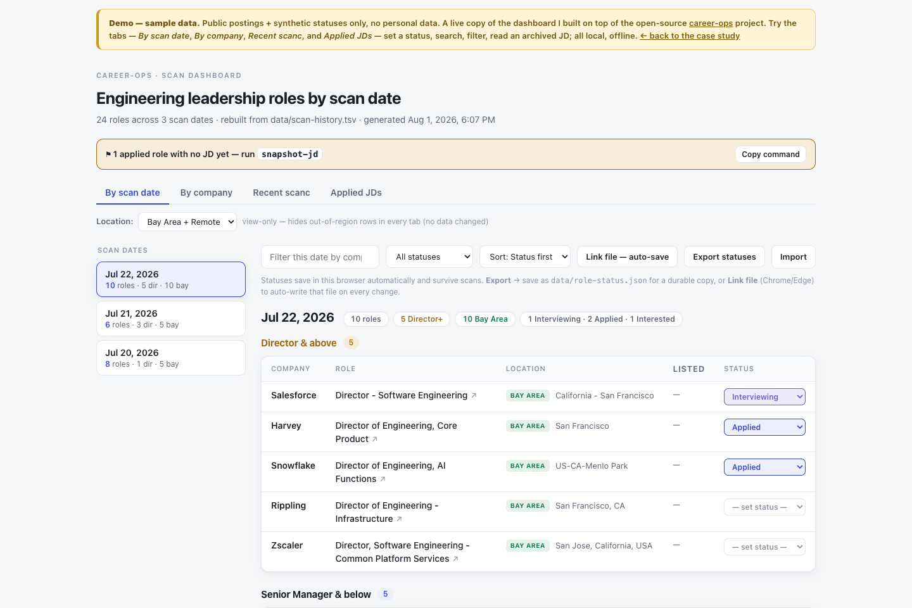

# career-ops extensions — a case study in AI-assisted engineering

I directed an AI coding agent (Claude Code) to turn my own Engineering-Director / EM
job search into a **running, instrumented system** on top of the open-source
[**career-ops**](https://github.com/santifer/career-ops) multi-agent job-search tool —
**without forking it or breaking its upgrade path**. The interesting part isn't what the
AI generated; it's the **five judgment calls** where I overrode the easy, wrong default to
keep it production-grade: upgrade-safe, honest (never fabricates a job description),
least-privilege, and zero-token.

**▶ [Live demo](https://surajn.github.io/career-ops-ext/demo.html)**
· **[Case study](https://surajn.github.io/career-ops-ext/)**

> **Attribution.** The foundation is [career-ops](https://github.com/santifer/career-ops)
> (MIT, © Santiago Fernández de Valderrama) — a system I did **not** write. This repo
> contains only my **extensions** on top of it, built by directing Claude Code. No
> base-project code is redistributed here. See [ATTRIBUTION.md](ATTRIBUTION.md).

[](https://surajn.github.io/career-ops-ext/demo.html)

## What's here
| Path | What it is |
|------|------------|
| `index.html` | The case study — the thesis + the five judgment calls (what / why / how / impact). |
| `demo.html` | Live, offline dashboard on a **sanitized public sample** — four tabs (*By scan date*, *By company*, *Recent scanc*, *Applied JDs*), status tracking, and the pending-JD banner. Public postings + synthetic statuses only. |
| `output/dashboard/gen.mjs` | The real dashboard generator — a zero-dependency Node script that renders the scan/scanc TSVs + archived JDs into one self-contained, offline HTML page (with a self-check gate that refuses to ship broken JS). |
| `plugins/outlook-applied/` | The read-only Microsoft Graph email-check plugin (design + code; dormant). |
| `data/scan-history.tsv`, `data/scanc-history.tsv` | The sanitized sample datasets (public postings only). |
| `jds/` | A few **sample** archived job descriptions to demo the Applied-JDs tab (generic illustrative text, not real postings). |

## The engineering, in one paragraph
Every extension lives in **career-ops's user-extension layer** — gitignored paths the
project's own updater (`update-system.mjs`) is contractually forbidden to touch (its
`USER_PATHS` guard aborts if an update would modify them) — with **zero imports from system
code**, so upstream changes can't break it, and it rode auto-updates `v1.19 → v1.22`
untouched. The same discipline shows up everywhere: a **JD archiver that never fabricates**
(a dead posting yields an honest stub, not invented text); a **serverless-but-stateful**
dashboard that persists to disk from a static `file://` page via the File System Access
API; **zero-token** discovery (structured ATS APIs, not model calls); a **least-privilege**
email design (read-only scope, egress allow-listed, no password stored); and a **root-cause**
approach to a silent recall bug (I traced *why* real roles were dropped before choosing the
upgrade-safe fix).

## Run the demo locally
```bash
node output/dashboard/gen.mjs   # reads data/scan-history.tsv → output/dashboard/index.html
```
Open the generated HTML in any browser — no server, no build step, no tokens. (The
committed `demo.html` is that output with a "sample data" banner added.)

## Publish the public page (GitHub Pages)
1. Create a public repo named `career-ops-ext`, push this folder.
2. Repo **Settings → Pages → Build and deployment → Deploy from a branch → `main` / root**.
3. Your public URL: `https://surajn.github.io/career-ops-ext/`

## License
My extensions: [MIT](LICENSE) © 2026 Suraj Natarajan. Base project career-ops: MIT ©
Santiago Fernández de Valderrama.
